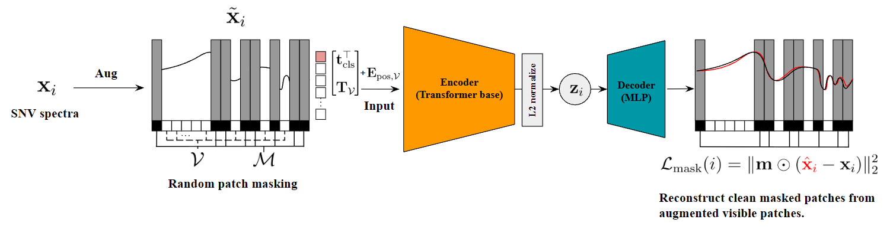

<h1 align="center">ChemoMAE</h1>

[](https://pypi.org/project/chemomae/)
[](#)
[](https://github.com/Mantis-Ryuji/ChemoMAE/actions/workflows/ci.yml)
[](https://pypi.org/project/chemomae/)
[](LICENSE)

> **ChemoMAE**: A research-oriented PyTorch toolkit for **1D spectral representation learning, hypersphere-aware augmentation, and hyperspherical clustering** .

---

## Why ChemoMAE?

Traditional chemometrics has long relied on **linear methods** such as PCA and PLS.
While these methods remain foundational, they often struggle to capture the **nonlinear structures** and **high-dimensional variability** present in modern spectral datasets.

ChemoMAE is motivated by the geometry induced by **Standard Normal Variate (SNV)** preprocessing. SNV centers each spectrum and scales it to unit variance, making the L2 norm essentially constant across samples. This means that sample-wise magnitude is no longer a meaningful degree of freedom after preprocessing; what remains informative is primarily the relative spectral shape, or direction, on the normalized spectral manifold. ChemoMAE is therefore designed to learn latent representations that emphasize directional structure while avoiding unnecessary dependence on latent norm.

<p align="center">

</p>

### 1. Extending Chemometrics with Deep Learning

ChemoMAE introduces a **Transformer-based Masked Autoencoder (MAE)** specialized for **1D spectra** .

* spectra are divided into contiguous **patches**
* masking is applied **patch-wise**
* reconstruction loss is computed only on the **masked spectral regions**
* the encoder produces latent representations `z` that are naturally compatible with **cosine similarity**

> [!NOTE]
> The latent embedding `z` can be L2-normalized to unit norm (`latent_normalize=True`, default). Disable this (`latent_normalize=False`) if you prefer unconstrained embeddings.

This architecture aligns naturally with the **hyperspherical geometry** induced by SNV, making the learned representations well suited for **cosine-based clustering** , retrieval, and downstream analysis.

### 2. Hypersphere-Aware Augmentation

ChemoMAE also provides a **spectral augmenter** designed specifically for SNV-normalized spectra.

Instead of applying unconstrained Euclidean perturbations, `SpectraAugmenter` applies weak spectral perturbations while maintaining the geometry induced by SNV preprocessing. In particular, the augmenter can re-center each augmented spectrum to zero mean and re-normalize it to the original per-spectrum L2 norm.

The current implementation supports:

* **fractional shift**
  small wavelength-axis perturbation using interpolation
* **tangent Gaussian noise**
  random local perturbation constructed in the tangent space of the hypersphere

Fractional shift is controlled by the shift amount in channel-index units, while tangent Gaussian noise is controlled by a geodesic angle range in degrees.

These augmentations are intended as **auxiliary regularization** for masked reconstruction, not as a strong contrastive multi-view augmentation pipeline.

### 3. Hyperspherical Geometry Toolkit

The latent embeddings, when L2-normalized, reside on a **unit hypersphere** .
Built-in clustering modules — **Cosine K-Means** and **vMF Mixture** — leverage this geometry directly and are therefore more appropriate than Euclidean clustering when the signal is primarily **directional spectral variation** .

---

## Quick Start

Install ChemoMAE:

```bash
pip install chemomae
```

---

## ChemoMAE Example

<details>
<summary><b>Example</b></summary>

### 1. SNV Preprocessing

Import `SNVScaler`.

SNV standardizes each spectrum to have zero mean and unit variance. This removes baseline and scaling effects while preserving spectral shape. After SNV, all spectra have the same L2 norm:

```math
\lVert x_{\mathrm{snv}} \rVert_2 = \sqrt{L - 1}
```

For example, for 256-dimensional spectra,

```math
\lVert x_{\mathrm{snv}} \rVert_2 = \sqrt{255} \approx 15.97
```

Hence, SNV maps spectra onto a constant-radius hypersphere.

```python
from chemomae.preprocessing import SNVScaler

# X_*: reflectance data (np.ndarray)
# Expected shape: (N, 256)
preprocessed = []
for X in [X_train, X_val, X_test]:
    sc = SNVScaler()
    X_snv = sc.transform(X)
    preprocessed.append(X_snv)

X_train_snv, X_val_snv, X_test_snv = preprocessed
```

### 2. Dataset and DataLoader Preparation

Convert NumPy arrays into PyTorch tensors and build DataLoaders.

```python
from chemomae.utils import set_global_seed
import torch
from torch.utils.data import DataLoader, TensorDataset

set_global_seed(42)

train_ds = TensorDataset(torch.as_tensor(X_train_snv, dtype=torch.float32))
val_ds   = TensorDataset(torch.as_tensor(X_val_snv,   dtype=torch.float32))
test_ds  = TensorDataset(torch.as_tensor(X_test_snv,  dtype=torch.float32))

train_loader = DataLoader(train_ds, batch_size=1024, shuffle=True,  drop_last=False)
val_loader   = DataLoader(val_ds,   batch_size=1024, shuffle=False, drop_last=False)
test_loader  = DataLoader(test_ds,  batch_size=1024, shuffle=False, drop_last=False)
```

### 3. Model, Optimizer, and Scheduler Setup

Define ChemoMAE and a standard optimization pipeline.

```python
from chemomae.models import ChemoMAE
from chemomae.training import build_optimizer, build_scheduler

model = ChemoMAE(
    seq_len=256,
    d_model=256,
    nhead=4,
    num_layers=4,
    dim_feedforward=1024,
    dropout=0.1,
    latent_dim=16,
    latent_normalize=True,
    decoder_num_layers=2,
    n_patches=32,
    n_mask=16,
)

opt = build_optimizer(
    model,
    lr=1.0e-3,
    weight_decay=0.05,
    betas=(0.9, 0.95),
)

sched = build_scheduler(
    opt,
    steps_per_epoch=max(1, len(train_loader)),
    epochs=500,
    warmup_epochs=10,
    min_lr_scale=0.1,
)
```

### 4. Optional Spectral Augmentation

Define a hypersphere-aware augmenter for SNV-normalized spectra.

```python
from chemomae.training import SpectraAugmenter, SpectraAugmenterConfig

aug_cfg = SpectraAugmenterConfig(
    shift_prob=0.5,
    shift_delta_range=(-2.0, 2.0),
    noise_prob=0.5,
    noise_angle_deg_range=(0.5, 3.0),
    shuffle_order_per_batch=True,
    recenter_after_each_op=True,
    renorm_to_input_norm=True,
)

augmenter = SpectraAugmenter(aug_cfg)
```

The model input is augmented, but the reconstruction target remains the **original** spectrum.

This provides weak denoising-style regularization while preserving the SNV-compatible geometry of the input spectra.

### 5. Training Setup (Trainer + Config)

`Trainer` orchestrates the fixed-budget self-supervised training loop with:

* AMP (Automatic Mixed Precision)
* EMA (Exponential Moving Average of model weights)
* optional `SpectraAugmenter`
* gradient clipping
* checkpointing / resume
* JSON logging
* final weights export

ChemoMAE does **not** use validation-loss-based early stopping or best-checkpoint selection.
Training is controlled by a predefined epoch / step budget, and the final model is selected by an explicit rule such as EMA-last weights.

```python
from chemomae.training import TrainerConfig, Trainer

trainer_cfg = TrainerConfig(
    out_dir="runs",
    device="cuda",
    amp=True,
    amp_dtype="bf16",
    enable_tf32=False,
    grad_clip=1.0,
    use_ema=True,
    ema_decay=0.999,
    loss_type="mse",
    reduction="mean",
    resume_from="auto",
)

trainer = Trainer(
    model,
    opt,
    train_loader,
    scheduler=sched,
    augmenter=augmenter,
    cfg=trainer_cfg,
)

result = trainer.fit(epochs=500)
print(result["final_model"])  # "ema_last_model.pt" if EMA is enabled
```

During training, ChemoMAE produces the following outputs under `out_dir`:

```text
runs/
├── training_history.json
│    ↳ Per-epoch records:
│       [
│         {
│           "epoch": 1,
│           "train_loss": ...,
│           "lr": ...,
│           "time_sec": ...
│         },
│         ...
│       ]
│
├── last_model.pt
│    ↳ Final raw model weights at the end of training
│
├── ema_last_model.pt
│    ↳ Final EMA weights at the end of training
│       (saved only when EMA is enabled)
│
└── checkpoints/
     └── last.pt
          ↳ Full checkpoint for resume:
             model + optimizer + scheduler + scaler + EMA + history
```

### 6. Evaluation (Tester + Config)

The `Tester` evaluates masked reconstruction loss on a dataset.

It supports:

* masked-only reconstruction loss
* AMP (`bf16` / `fp16`)
* optional fixed visible masks
* optional `SpectraAugmenter`
* JSON logging to a test-history file

```python
from chemomae.training import TesterConfig, Tester

tester_cfg = TesterConfig(
    out_dir="runs",
    device="cuda",
    amp=True,
    amp_dtype="bf16",
    loss_type="mse",
    reduction="mean",
    fixed_visible=None,
    log_history=True,
    history_filename="test_history.json",
)

tester = Tester(
    model,
    tester_cfg,
    augmenter=None,
)

test_loss = tester(test_loader)
print(f"Test Loss: {test_loss:.6f}")
```

When `augmenter` is provided, the Tester applies augmentation to the model input while keeping the reconstruction target as the original spectrum:

```python
tester = Tester(
    model,
    tester_cfg,
    augmenter=augmenter,
)
```

This evaluates reconstruction robustness under input perturbations. 

### 7. Latent Extraction (Extractor + Config)

Extract latent embeddings from a trained ChemoMAE using **all-visible encoding**.

By default, `Extractor` does not use ChemoMAE masking. It directly calls the encoder with an all-visible mask, so the full spectrum is used for latent feature extraction.

```python
from chemomae.training import ExtractorConfig, Extractor

extractor_cfg = ExtractorConfig(
    device="cuda",
    amp=True,
    amp_dtype="bf16",
    save_path=None,
    return_numpy=False,
)

extractor = Extractor(
    model,
    extractor_cfg,
    augmenter=None,
)

latent_test = extractor(test_loader)
```

When `augmenter` is provided, the Extractor applies augmentation before encoder inference:

```python id="lodtvq"
extractor = Extractor(
    model,
    extractor_cfg,
    augmenter=augmenter,
)

latent_test_aug = extractor(test_loader)
```

Without an augmenter, latent extraction is deterministic with respect to ChemoMAE masking because all positions are treated as visible. With an augmenter, extracted embeddings may vary due to stochastic spectral shift/noise augmentation.

### 8. Clustering with Cosine K-Means

Cluster latent vectors using cosine geometry.

```python
from chemomae.clustering import CosineKMeans, elbow_ckmeans

k_list, inertias, K, idx, kappa = elbow_ckmeans(
    CosineKMeans,
    latent_test,
    device="cuda",
    k_max=50,
    chunk=5_000_000,
    random_state=42,
)

ckm = CosineKMeans(
    n_components=K,
    tol=1e-4,
    max_iter=500,
    device="cuda",
    random_state=42,
)

ckm.fit(latent_test, chunk=5_000_000)
ckm.save_centroids("runs/ckm.pt")
labels = ckm.predict(latent_test, chunk=5_000_000)
```

### 9. Clustering with vMF Mixture

Probabilistic hyperspherical clustering.

```python
from chemomae.clustering import VMFMixture, elbow_vmf

k_list, scores, K, idx, kappa = elbow_vmf(
    VMFMixture,
    latent_test,
    device="cuda",
    k_max=50,
    chunk=5_000_000,
    random_state=42,
    criterion="bic",
)

vmf = VMFMixture(
    n_components=K,
    tol=1e-4,
    max_iter=500,
    device="cuda",
    random_state=42,
)

vmf.fit(latent_test, chunk=5_000_000)
vmf.save("runs/vmf.pt")
labels = vmf.predict(latent_test, chunk=5_000_000)
```

</details>

---

## Library Features

<details>
<summary><b><code>chemomae.preprocessing</code></b></summary>

### `SNVScaler`

* [Document](https://github.com/Mantis-Ryuji/ChemoMAE/blob/main/docs/preprocessing/snv.md)
* [Implementation](https://github.com/Mantis-Ryuji/ChemoMAE/blob/main/src/chemomae/preprocessing/snv.py)

`SNVScaler` performs **row-wise mean subtraction and variance scaling** . Each spectrum is centered and divided by its **unbiased standard deviation** (`ddof=1`).
It is a **stateless** transformer supporting both **NumPy** and **PyTorch** , preserving the original **framework, device, and dtype** .

When `transform_stats=True`, it returns `(Y, mu, sd)`, where `sd` already includes `eps` and can be directly used for inverse reconstruction.

After SNV, all rows have **zero mean** and **unit variance** , producing a constant L2 norm of `sqrt(L - 1)`, thereby mapping spectra onto a constant-radius **hypersphere** — ideal for cosine-based clustering.

```python
import numpy as np
from chemomae.preprocessing import SNVScaler

X = np.array([[1.0, 2.0, 3.0],
              [4.0, 5.0, 6.0]], dtype=np.float32)

scaler = SNVScaler()
Y = scaler.transform(X)

scaler = SNVScaler(transform_stats=True)
Y, mu, sd = scaler.transform(X)
X_rec = scaler.inverse_transform(Y, mu=mu, sd=sd)
```

**Key Features**

* unbiased standard deviation (`ddof=1`, with automatic fallback for `L=1`)
* numerically stable `eps` handling
* float64 internal computation
* Torch-compatible device and dtype preservation

**When to Use**

* Standard preprocessing for NIR spectra
* Before cosine-based modeling or clustering

---

### `cosine_fps_downsample`

* [Document](https://github.com/Mantis-Ryuji/ChemoMAE/blob/main/docs/preprocessing/dowmsampling.md)
* [Implementation](https://github.com/Mantis-Ryuji/ChemoMAE/blob/main/src/chemomae/preprocessing/downsampling.py)

`cosine_fps_downsample` performs **Farthest-Point Sampling (FPS)** under **hyperspherical geometry** , selecting spectra that are maximally diverse in **direction** .

Internally, all rows are **L2-normalized** for selection, but the returned subset is drawn from the **original-scale** input `X`.
It supports both NumPy and PyTorch inputs and automatically leverages CUDA when available.

```python
import numpy as np
from chemomae.preprocessing import cosine_fps_downsample

X = np.random.randn(1000, 128).astype(np.float32)
X_sub = cosine_fps_downsample(X, ratio=0.1, seed=42)
```

**Key Features**

* internal normalization for cosine-based selection
* output kept in original scale
* device-aware Torch support

**When to Use**

* diversity-driven subsampling
* reducing redundancy in large spectral datasets

</details>

<details>
<summary><b><code>chemomae.models</code></b></summary>

### `ChemoMAE`

* [Document](https://github.com/Mantis-Ryuji/ChemoMAE/blob/main/docs/models/chemo_mae.md)
* [Implementation](https://github.com/Mantis-Ryuji/ChemoMAE/blob/main/src/chemomae/models/chemo_mae.py)

`ChemoMAE` is a **Masked Autoencoder for 1D spectra**.

It adopts a **patch-token formulation** , where contiguous spectral bands are grouped into patches and masking is performed **at the patch level** .
The encoder processes only the **visible patch tokens** together with a CLS token, and the decoder reconstructs the full spectrum using a **lightweight MLP decoder** .

The CLS output is projected to a `latent_dim` vector and may be **L2-normalized**, yielding embeddings naturally suited to cosine similarity and hyperspherical clustering.

```python
import torch
from chemomae.models import ChemoMAE

mae = ChemoMAE(
    seq_len=256,
    d_model=256,
    nhead=4,
    num_layers=4,
    dim_feedforward=1024,
    decoder_num_layers=2,
    latent_dim=8,
    latent_normalize=True,
    n_patches=32,
    n_mask=16,
)

x = torch.randn(8, 256)
x_rec, z, visible = mae(x)
```

**Key Features**

* patch-wise masking
* Transformer encoder over visible tokens
* lightweight MLP decoder
* optional L2-normalized latent
* cosine-friendly embeddings

**When to Use**

* learning geometry-aware spectral representations
* downstream clustering, visualization, or supervised fine-tuning

</details>

<details>
<summary><b><code>chemomae.training</code></b></summary>

### `build_optimizer` & `build_scheduler`

* [Document](https://github.com/Mantis-Ryuji/ChemoMAE/blob/main/docs/training/optim.md)
* [Implementation](https://github.com/Mantis-Ryuji/ChemoMAE/blob/main/src/chemomae/training/optim.py)

Utility functions for a standardized Transformer-style optimization pipeline.

* `build_optimizer` creates grouped **AdamW**
* `build_scheduler` creates **linear warmup → cosine decay**

```python
from chemomae.models import ChemoMAE
from chemomae.training import build_optimizer, build_scheduler

model = ChemoMAE(seq_len=256)
optimizer = build_optimizer(model, lr=1.0e-3, weight_decay=0.05)
scheduler = build_scheduler(
    optimizer,
    steps_per_epoch=len(train_loader),
    epochs=100,
    warmup_epochs=5,
)
```

---

### `SpectraAugmenterConfig` & `SpectraAugmenter`

* [Document](https://github.com/Mantis-Ryuji/ChemoMAE/blob/main/docs/training/augmenter.md)
* [Implementation](https://github.com/Mantis-Ryuji/ChemoMAE/blob/main/src/chemomae/training/augmenter.py)

`SpectraAugmenter` provides **SNV-geometry-aware augmentation** for SNV-normalized spectra.

After SNV preprocessing, each spectrum is approximately mean-centered and has a fixed per-spectrum norm.
Instead of applying unconstrained Euclidean perturbations, `SpectraAugmenter` applies weak spectral perturbations and optionally projects the result back toward the SNV-compatible geometry by:

* re-centering each spectrum to mean zero
* re-normalizing each spectrum to the original per-spectrum L2 norm

The current implementation supports two augmentations:

* **fractional shift**
  A small wavelength-axis perturbation implemented by interpolation.

* **tangent Gaussian noise**
  A random local perturbation constructed by projecting Gaussian noise onto the tangent space and rotating the spectrum by a sampled angle.

Fractional shift is controlled by `shift_delta_range`, while tangent Gaussian noise is controlled by `noise_angle_deg_range`.

```python
from chemomae.training import SpectraAugmenter, SpectraAugmenterConfig

aug_cfg = SpectraAugmenterConfig(
    shift_prob=0.5,
    shift_delta_range=(-2.0, 2.0),
    noise_prob=0.5,
    noise_angle_deg_range=(0.5, 3.0),
    shuffle_order_per_batch=True,
    recenter_after_each_op=True,
    renorm_to_input_norm=True,
    eps=1.0e-8,
)

augmenter = SpectraAugmenter(aug_cfg)

augmenter.train()
x_aug = augmenter(x)
```

**Key Features**

* SNV-compatible spectral augmentation
* fractional wavelength-axis shift
* tangent-space Gaussian perturbation
* probability-controlled operation application
* delta-controlled fractional shift
* angle-controlled tangent Gaussian noise
* optional random ordering of shift/noise operations
* optional re-centering to zero mean after each operation
* optional re-normalization to the input L2 norm after each operation
* implemented as `nn.Module`, so it supports `.to(device)`
* automatically inactive in `eval()` mode

**Mode Behavior**

`SpectraAugmenter` applies augmentation only in `train()` mode.

```python
augmenter.train()
x_aug = augmenter(x)  # augmentation is applied

augmenter.eval()
x_same = augmenter(x)  # input is returned unchanged
```

This behavior is important when using the augmenter outside the Trainer.
For example, `Extractor` and `Tester` temporarily set the augmenter to `train()` when augmentation is explicitly requested, while keeping the ChemoMAE model itself in `eval()` mode.

**When to Use**

* during ChemoMAE pretraining on SNV-normalized spectra
* when you want denoising-style pretraining, where the model receives weakly perturbed spectra but reconstructs the original spectra
* when evaluating reconstruction robustness under controlled spectral perturbations
* when extracting augmented latent representations for robustness checks or test-time augmentation style analysis
* when perturbations should remain compatible with cosine-based or hyperspherical downstream analysis

---

### `TrainerConfig` & `Trainer`

* [Document](https://github.com/Mantis-Ryuji/ChemoMAE/blob/main/docs/training/trainer.md)
* [Implementation](https://github.com/Mantis-Ryuji/ChemoMAE/blob/main/src/chemomae/training/trainer.py)

`TrainerConfig` and `Trainer` form the **core training engine** of ChemoMAE.

They provide a fixed-budget training loop for **masked reconstruction**, with support for:

* AMP (`bf16` / `fp16`)
* optional TF32
* EMA parameter tracking
* optional `SpectraAugmenter`
* gradient clipping
* checkpointing and resume
* weights-only export for final model variants
* JSON history logging

ChemoMAE does **not** use validation-loss-based early stopping or best-checkpoint selection.
Training is controlled by a predefined epoch / step budget, and the final model is selected by an explicit rule such as EMA-last weights.

```python
from chemomae.models import ChemoMAE
from chemomae.training import (
    Trainer,
    TrainerConfig,
    SpectraAugmenter,
    SpectraAugmenterConfig,
    build_optimizer,
    build_scheduler,
)

model = ChemoMAE(seq_len=256, latent_dim=16, n_patches=32, n_mask=24)

cfg = TrainerConfig(
    out_dir="runs",
    device="cuda",
    amp=True,
    amp_dtype="bf16",
    enable_tf32=False,
    grad_clip=1.0,
    use_ema=True,
    ema_decay=0.999,
    loss_type="mse",
    reduction="mean",
    resume_from="auto",
)

aug_cfg = SpectraAugmenterConfig(
    shift_prob=0.5,
    shift_delta_range=(-2.0, 2.0),
    noise_prob=0.5,
    noise_angle_deg_range=(0.5, 3.0),
    shuffle_order_per_batch=True,
    recenter_after_each_op=True,
    renorm_to_input_norm=True,
)
augmenter = SpectraAugmenter(aug_cfg)

optimizer = build_optimizer(model, lr=1.0e-3, weight_decay=0.05)

epochs = 800
scheduler = build_scheduler(
    optimizer,
    steps_per_epoch=len(train_loader),
    epochs=epochs,
    warmup_epochs=40,
)

trainer = Trainer(
    model,
    optimizer,
    train_loader,
    scheduler=scheduler,
    augmenter=augmenter,
    cfg=cfg,
)

_ = trainer.fit(epochs=epochs)
```

**Key Features**

* automatic device and precision handling
* fixed epoch / fixed step SSL pretraining
* EMA tracking after each optimizer step
* EMA-consistent final export behavior:
  * final raw weights → `last_model.pt`
  * final EMA weights → `ema_last_model.pt` if EMA is enabled
* `checkpoints/last.pt` stores the full resumable training state
* optional train-time spectral augmentation
* batch-wise scheduler stepping
* atomic JSON history logging

**Outputs**

```text
runs/
├── training_history.json
│    ↳ Per-epoch records:
│       [
│         {
│           "epoch": 1,
│           "train_loss": ...,
│           "lr": ...,
│           "time_sec": ...
│         },
│         ...
│       ]
│
├── last_model.pt
│    ↳ Final raw model weights at the end of training
│
├── ema_last_model.pt
│    ↳ Final EMA weights at the end of training
│       (saved only when EMA is enabled)
│
└── checkpoints/
     └── last.pt
          ↳ Full checkpoint for resume:
             model + optimizer + scheduler + scaler + EMA + history
```

**When to Use**

* fixed-budget masked reconstruction pretraining for ChemoMAE
* validation-free SSL pretraining
* training runs where model selection is handled by an explicit final rule, such as EMA-last weights

---

### `TesterConfig` & `Tester`

* [Document](https://github.com/Mantis-Ryuji/ChemoMAE/blob/main/docs/training/tester.md)
* [Implementation](https://github.com/Mantis-Ryuji/ChemoMAE/blob/main/src/chemomae/training/tester.py)

`Tester` provides a lightweight evaluation loop for trained ChemoMAE models.

It computes **masked reconstruction loss** (SSE/MSE) over a DataLoader, with AMP support, optional fixed visible masks, optional `SpectraAugmenter`, and JSON logging.

```python
from chemomae.training import Tester, TesterConfig

cfg = TesterConfig(
    out_dir="runs",
    device="cuda",
    amp=True,
    amp_dtype="bf16",
    loss_type="mse",
    reduction="mean",
    fixed_visible=None,
    log_history=True,
    history_filename="test_history.json",
)

tester = Tester(
    model,
    cfg,
    augmenter=None,
)

avg_loss = tester(test_loader)
print("Test loss:", avg_loss)
```

When `augmenter` is provided, `Tester` evaluates reconstruction from augmented inputs while keeping the reconstruction target as the original spectrum.

```python
tester = Tester(
    model,
    cfg,
    augmenter=augmenter,
)
```

**When to Use**

* evaluating masked reconstruction loss
* comparing reconstruction behavior under fixed visible masks
* evaluating robustness to weak spectral perturbations
* logging test losses separately from training history

---

### `ExtractorConfig` & `Extractor`

* [Document](https://github.com/Mantis-Ryuji/ChemoMAE/blob/main/docs/training/extractor.md)
* [Implementation](https://github.com/Mantis-Ryuji/ChemoMAE/blob/main/src/chemomae/training/extractor.py)

`Extractor` provides a latent extraction pipeline from trained ChemoMAE models in **all-visible mode**.

It directly calls the encoder with an all-visible mask, so ChemoMAE masking is not used during extraction. Without an augmenter, this gives deterministic latent embeddings with respect to masking.

It supports AMP inference, Torch/NumPy return types, optional saving, and optional `SpectraAugmenter`.

```python
from chemomae.training import Extractor, ExtractorConfig

cfg = ExtractorConfig(
    device="cuda",
    amp=True,
    amp_dtype="bf16",
    save_path=None,
    return_numpy=True,
)

extractor = Extractor(
    model,
    cfg,
    augmenter=None,
)

Z = extractor(loader)
```

When `augmenter` is provided, `Extractor` applies augmentation before encoder inference.

```python
extractor = Extractor(
    model,
    cfg,
    augmenter=augmenter,
)

Z_aug = extractor(loader)
```

With an augmenter, extracted embeddings may vary across calls because spectral shift/noise augmentation can be stochastic.

**When to Use**

* extracting latents for clustering
* visualization
* downstream analysis
* robustness checks using augmented latent embeddings

</details>

<details>
<summary><b><code>chemomae.clustering</code></b></summary>

### `CosineKMeans` & `elbow_ckmeans`

* [Document](https://github.com/Mantis-Ryuji/ChemoMAE/blob/main/docs/clustering/cosine_kmeans.md)
* [Implementation](https://github.com/Mantis-Ryuji/ChemoMAE/blob/main/src/chemomae/clustering/cosine_kmeans.py)

`CosineKMeans` implements **hyperspherical k-means** with cosine similarity.

```python
import torch
from chemomae.clustering import CosineKMeans, elbow_ckmeans

X = torch.randn(10_000, 64)
ckm = CosineKMeans(n_components=12, device="cuda", random_state=42)
ckm.fit(X)
labels = ckm.predict(X)
```

**When to Use**

* clustering unit-sphere embeddings
* model selection of `K` under cosine geometry

---

### `VMFMixture` & `elbow_vmf`

* [Document](https://github.com/Mantis-Ryuji/ChemoMAE/blob/main/docs/clustering/vmf_mixture.md)
* [Implementation](https://github.com/Mantis-Ryuji/ChemoMAE/blob/main/src/chemomae/clustering/vmf_mixture.py)

`VMFMixture` fits a **von Mises–Fisher mixture model** on the unit hypersphere.

```python
import torch
from chemomae.clustering import VMFMixture, elbow_vmf

X = torch.randn(10000, 64, device="cuda")
vmf = VMFMixture(n_components=16, device="cuda", random_state=42)
vmf.fit(X)
labels = vmf.predict(X)
```

**When to Use**

* probabilistic clustering of unit-sphere embeddings
* BIC / NLL-based model selection under cosine geometry

---

### `silhouette_samples_cosine_gpu` & `silhouette_score_cosine_gpu`

* [Document](https://github.com/Mantis-Ryuji/ChemoMAE/blob/main/docs/clustering/metric.md)
* [Implementation](https://github.com/Mantis-Ryuji/ChemoMAE/blob/main/src/chemomae/clustering/metric.py)

Cosine-based GPU-accelerated silhouette metrics for clustering evaluation.

```python
import numpy as np
from chemomae.clustering import silhouette_score_cosine_gpu

X = np.random.randn(100, 16).astype(np.float32)
labels = np.random.randint(0, 4, size=100)

score = silhouette_score_cosine_gpu(X, labels, device="cpu")
print(score)
```

</details>

<details>
<summary><b><code>chemomae.utils</code></b></summary>

### `set_global_seed`

* [Document](https://github.com/Mantis-Ryuji/ChemoMAE/blob/main/docs/utils/seed.md)
* [Implementation](https://github.com/Mantis-Ryuji/ChemoMAE/blob/main/src/chemomae/utils/seed.py)

Unified seeding for **Python**, **NumPy**, and **PyTorch**, with optional CuDNN determinism.

```python
from chemomae.utils import set_global_seed

set_global_seed(42)
```

**When to Use**

* at the start of any experiment
* before training, testing, clustering, or extraction

</details>

---

## License

ChemoMAE is released under the **Apache License 2.0**, a permissive open-source license that allows both academic and commercial use with minimal restrictions.

You are free to:

* **use** the code
* **modify** it
* **distribute** modified or unmodified versions

provided that the original copyright notice and license text are preserved.

The software is provided **“as is”**, without warranty of any kind.

For complete terms, see the official license text:
[https://www.apache.org/licenses/LICENSE-2.0](https://www.apache.org/licenses/LICENSE-2.0)