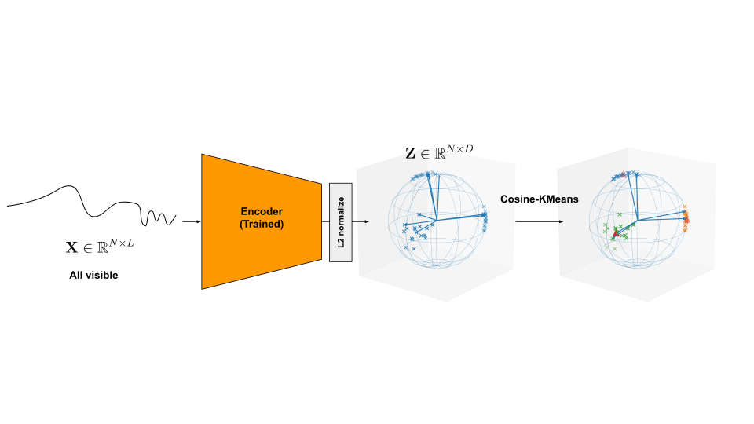

# CosineKMeans — Spherical K-Means Clustering

> Module: `chemomae.clustering.cosine_kmeans`

This document describes **CosineKMeans**, an implementation of spherical k-means with cosine similarity, and **elbow_ckmeans** for model selection.

<p align="center">

</p>

---

## Overview

* **Objective**: minimize mean cosine dissimilarity

```math
J = \mathrm{mean}\,(1 - \cos(x, c))
```
* **E-step**: Assign each sample to centroid with maximum cosine similarity.
* **M-step**: Update centroids as L2-normalized mean of assigned samples.
* **Initialization**: k-means++ (optionally squared distances).
* **Streaming support**: For large datasets, computation can be chunked from CPU → GPU.
* **Precision**: Internally uses fp32 even if inputs are half/bf16.
* **Post-condition**: Centroids are always L2-normalized (unit vectors).

---

## API

### Class: `CosineKMeans`

```python
ckm = CosineKMeans(
    n_components=8,
    tol=1e-3,
    max_iter=500,
    device="cuda",
    random_state=42,
    use_squared_init=False,
)
```

**Parameters**

* `n_components` (`int`): Number of clusters K.
* `tol` (`float`): Convergence tolerance on inertia (relative or absolute).
* `max_iter` (`int`): Maximum EM iterations.
* `device` (`str|torch.device`): Training device.
* `random_state` (`int|None`): RNG seed for reproducibility.
* `use_squared_init` (`bool`): If `True`, uses squared distances in k-means++ init.

**Attributes**

* `centroids` (`(K,D)` tensor): Learned cluster centers (unit norm).
* `latent_dim` (`int`): Feature dimension D.
* `inertia_` (`float`): Final objective value `mean(1 - cos)`.
* `_fitted` (`bool`): Whether the model has been trained.

---

### Methods

* **`fit(X, chunk=None)`** → self
  Fit centroids on dataset `X (N,D)`. If `chunk` > 0, enables streaming (CPU→GPU batches).

* **`fit_predict(X, chunk=None)`** → labels `(N,)`
  Fit and immediately return cluster assignments.

* **`predict(X, return_dist=False, chunk=None)`** → labels (and optionally distances)
  Predict assignments for new data. If `return_dist=True`, also returns `(N,K)` distance matrix (1 - cos).

* **`save_centroids(path)`**
  Save centroids + inertia to file via `torch.save`. Minimal state for reuse.

* **`load_centroids(path, strict_k=True)`** → self
  Load centroids from saved file. If `strict_k=True`, checks that K matches `n_components`.

---

## Example Usage

### Training and prediction

```python
from chemomae.clustering.cosine_kmeans import CosineKMeans

X = torch.randn(1000, 64)
ckm = CosineKMeans(n_components=10)
ckm.fit(X)
labels = ckm.predict(X)
```

### Saving and reloading

```python
ckm.save_centroids("centroids.pt")
ckm2 = CosineKMeans(n_components=10).load_centroids("centroids.pt")
labels2 = ckm2.predict(X)
```

### Streaming large data

```python
ckm = CosineKMeans(n_components=50, device="cuda")
ckm.fit(X, chunk=1000000)  # process in CPU→GPU chunks
```

### Distance output

```python
labels, dist = ckm.predict(X, return_dist=True)
```

---

## Model Selection — `elbow_ckmeans`

```python
from chemomae.clustering.cosine_kmeans import elbow_ckmeans

k_list, inertias, optimal_k, elbow_idx, kappa = elbow_ckmeans(
    CosineKMeans, X, k_max=30, chunk=1000000)
```

**Parameters**

* `cluster_module`: Constructor compatible with `CosineKMeans`.
* `X`: Input `(N,D)` tensor.
* `device`: Training device.
* `k_max`: Maximum K to test (1..k_max).
* `chunk`: Chunk size for streaming (optional).
* `verbose`: If True, prints per-K inertia.
* `random_state`: RNG seed.

**Returns**

* `k_list`: List of K values tested.
* `inertias`: Corresponding mean inertia values.
* `optimal_k`: Selected cluster count by curvature method.
* `elbow_idx`: Index in `k_list` where optimal_k occurs.
* `kappa`: Curvature score.

---

## Design Notes

* **Normalization**: Input features are row-normalized internally.
* **Empty clusters**: Reassigned to farthest points.
* **Inertia**: Uses mean(1 - cos), not Euclidean SSE.
* **Memory safety**: Frees GPU cache after each iteration in streaming/elbow.

---

## Minimal Tests

```python
X = torch.randn(200, 16)
ckm = CosineKMeans(n_components=5)
ckm.fit(X)
labels = ckm.predict(X)
assert labels.shape == (200,)

# Save/reload
ckm.save_centroids("tmp.pt")
ckm2 = CosineKMeans(n_components=5).load_centroids("tmp.pt")
assert torch.allclose(ckm.centroids, ckm2.centroids)
```

---

## Version

* Introduced in `chemomae.clustering.cosine_kmeans` — initial public draft.
