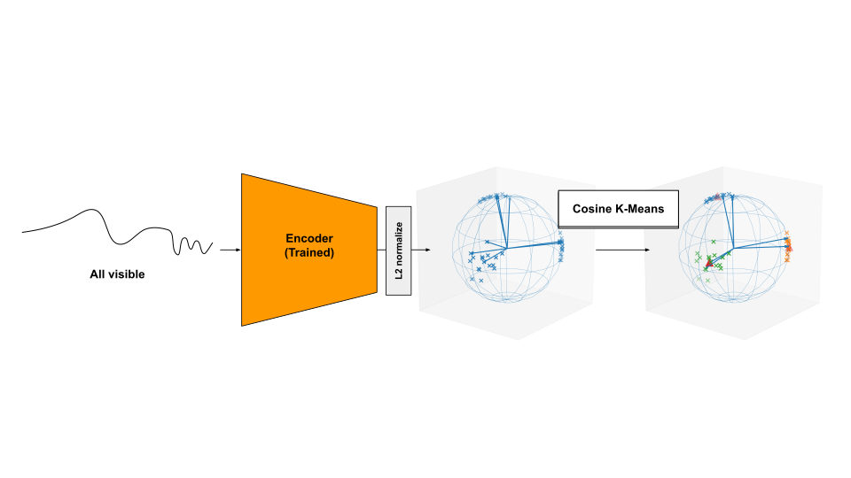

# CosineKMeans — Hyperspherical K-Means Clustering

> Module: `chemomae.clustering.cosine_kmeans`

This document describes **CosineKMeans**, an implementation of **hyperspherical k-means** using cosine similarity, and the helper function **`elbow_ckmeans`** for model selection.

<p align="center">

</p>

---

## Overview

* **Objective** — minimize mean cosine dissimilarity:

  ```math
  J = \mathrm{mean}\,(1 - \cos(x, c))
  ```

* **E-step:** Assign each sample to the centroid with the highest cosine similarity.

* **M-step:** Update centroids as the L2-normalized mean of assigned samples.

* **k-means++ Initialization:** Uses cosine dissimilarity for sampling (not squared), ensuring reproducible seeding with `random_state`.

* **Streaming support:** Large datasets can be processed in CPU→GPU chunks.

* **Precision:** Internally computed in `float32` (even for half/bf16 inputs).

* **Post-condition:** All centroids are L2-normalized (unit vectors).

---

## API

### Class: `CosineKMeans`

```python
ckm = CosineKMeans(
    n_components=8,
    tol=1e-4,
    max_iter=500,
    device="cuda",
    random_state=42
)
```

#### Parameters

| Name               | Type    | Default       | Description                                                  |
| ------------------ | ------- | ------------- | ------------------------------------------------------------ |
| `n_components`     | `int`   | —             | Number of clusters  $`K`$.                                   |
| `tol`              | `float` | `1e-4`        | Convergence tolerance on inertia.                            |
| `max_iter`         | `int`   | `500`         | Maximum number of EM iterations.                             |
| `device`           | `str` or `torch.device` | `"cuda"` | Device for computation.                           |
| `random_state`     | `int` or `None`         | `None`   | RNG seed for reproducibility.                     |


#### Attributes

| Name         | Type                  | Description                                        |
| ------------ | --------------------- | -------------------------------------------------- |
| `centroids`  | `torch.Tensor (K, D)` | Learned cluster centroids (L2-normalized).         |
| `latent_dim` | `int`                 | Feature dimension $`D`$.                           |
| `inertia_`   | `float`               | Final objective value $`\mathrm{mean}(1 - \cos)`$. |

---

### Methods

| Method                                      | Description                                                                      |
| ------------------------------------------- | -------------------------------------------------------------------------------- |
| `fit(X, chunk=None)`                        | Train centroids on data `X (N, D)`. If `chunk > 0`, enables streaming (CPU→GPU). |
| `fit_predict(X, chunk=None)`                | Fit and return cluster assignments.                                              |
| `predict(X, return_dist=False, chunk=None)` | Predict labels for `X`. Returns `(labels, dist)` if `return_dist=True`.          |
| `save_centroids(path)`                      | Save centroids and inertia via `torch.save()`.                                   |
| `load_centroids(path, strict_k=True)`       | Load centroids from file; check K consistency if `strict_k=True`.                |

---

## Usage Examples

### Training and prediction

```python
from chemomae.clustering.cosine_kmeans import CosineKMeans

X = torch.randn(1000, 64)
ckm = CosineKMeans(n_components=10)
ckm.fit(X)
labels = ckm.predict(X)
```

### Saving and reloading

```python
ckm.save_centroids("centroids.pt")
ckm2 = CosineKMeans(n_components=10).load_centroids("centroids.pt")
labels2 = ckm2.predict(X)
```

### Streaming large datasets

```python
ckm = CosineKMeans(n_components=50, device="cuda")
ckm.fit(X, chunk=1_000_000)  # process in CPU→GPU batches
```

### Returning distances

```python
labels, dist = ckm.predict(X, return_dist=True)
```

---

## Model Selection — `elbow_ckmeans`

```python
from chemomae.clustering.cosine_kmeans import elbow_ckmeans

# Automatically detects the optimal K by curvature
k_list, inertias, optimal_k, elbow_idx, kappa = elbow_ckmeans(CosineKMeans, X, k_max=30, chunk=1_000_000)
```

#### Parameters

| Name             | Type                   | Description                                   |
| ---------------- | ---------------------  | --------------------------------------------- |
| `cluster_module` | callable               | Constructor (compatible with `CosineKMeans`). |
| `X`              | `torch.Tensor (N, D)`  | Input dataset.                                |
| `device`         | `str` or `torch.device`| Target device.                                |
| `k_max`          | `int`                  | Maximum number of clusters to test.           |
| `chunk`          | `int` or `None`        | Optional streaming batch size.                |
| `verbose`        | `bool`                 | Print per-K inertia if `True`.                |
| `random_state`   | `int` or `None`        | RNG seed for reproducibility.                 |

#### Returns

| Name        | Type          | Description                                |
| ----------- | ------------- | ------------------------------------------ |
| `k_list`    | `list[int]`   | Values of K tested.                        |
| `inertias`  | `list[float]` | Corresponding mean inertia values.         |
| `optimal_k` | `int`         | Selected cluster count (curvature method). |
| `elbow_idx` | `int`         | Index of the optimal K in `k_list`.        |
| `kappa`     | `float`       | Curvature score at the elbow.              |

---

## Design Notes

* **Normalization:** Each input vector is internally L2-normalized before similarity computation.
* **Empty clusters:** If a cluster receives no assignments, it is reinitialized with the farthest sample.
* **Inertia metric:** Uses $`\mathrm{mean} (1 - \cos)`$, not Euclidean SSE.
* **Memory safety:** Frees GPU cache per iteration during streaming/elbow search.
* **Numerical stability:** Small epsilon added in normalization to avoid division by zero.

---

## Minimal Tests

```python
X = torch.randn(200, 16)
ckm = CosineKMeans(n_components=5)
ckm.fit(X)
labels = ckm.predict(X)
assert labels.shape == (200,)

# Save / reload
ckm.save_centroids("tmp.pt")
ckm2 = CosineKMeans(n_components=5).load_centroids("tmp.pt")
assert torch.allclose(ckm.centroids, ckm2.centroids)
```

---

## Version

* Introduced in `chemomae.clustering.cosine_kmeans` — initial public draft.