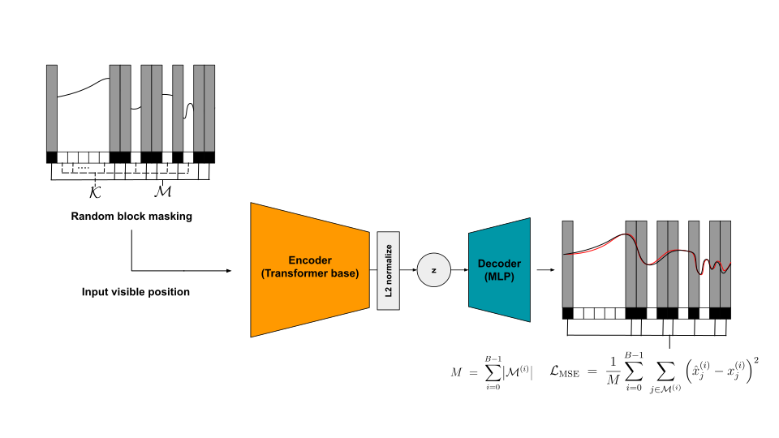

# ChemoMAE — Masked Autoencoder for 1D Spectra

> Module: `chemomae.models.chemo_mae`

This document describes **ChemoMAE**, a Transformer-based masked autoencoder specialized for **one-dimensional spectral data** (e.g., near-infrared (NIR) spectra or hyperspectral bands).

<p align="center">

</p>

---

## Overview

**ChemoMAE** adapts the **Masked Autoencoder (MAE)** framework (He et al., 2022) to 1D sequences.
Instead of image patches, each spectrum of length (L) is divided into **contiguous blocks** along the spectral axis, and a large fraction is randomly masked during training.
The encoder processes only the **visible tokens**, while the decoder reconstructs the entire sequence.
The reconstruction loss is computed **only on masked regions**, forcing the encoder to learn meaningful, context-aware spectral representations.

#### Key ideas

* **Block-wise masking:**
  The sequence is split into `n_blocks`, and `n_mask` blocks are randomly hidden per sample.
  This encourages the encoder to infer missing regions from spectral context.

* **Encoder:**
  Transformer encoder operating on visible tokens plus a prepended `[CLS]` token.
  The `[CLS]` output is projected to `latent_dim` and **L2-normalized**, yielding a latent vector on the **unit hypersphere** — naturally suited for cosine-based metrics and clustering.

* **Decoder:**
  Lightweight linear-projection decoder that reconstructs the full sequence of length (L) from the latent embedding.

---

## Architecture

### Positional Encoding

* Supports **learnable** (default) or **fixed sinusoidal** positional embeddings.
* Shape: `(1, L, d_model)` broadcastable across the batch.

### Masking

* Implemented via `make_block_mask(batch_size, seq_len, n_blocks, n_mask)`.
* Returns `(B, L)` boolean mask (`True = masked`).
* Internally converted to a **visible mask** (`True = visible`).

> `seq_len` must be divisible by `n_blocks`; otherwise an error is raised.

### Encoder — `ChemoEncoder`

* **Input:** spectra `(B, L)` with visible mask `(B, L)`.
* Linear projection → positional encoding → pack visible tokens + CLS → Transformer encoder.
* **Output:** L2-normalized latent `(B, latent_dim)` on the unit hypersphere.

### Decoder — `ChemoDecoderLP`

* **Input:** latent `(B, latent_dim)`
* **Output:** reconstruction `(B, L)`
* Designed to be lightweight so that most learning pressure lies on the encoder.

---

## API

### Class: `ChemoMAE`

```python
mae = ChemoMAE(
    seq_len=256,
    d_model=256,
    nhead=4,
    num_layers=4,
    dim_feedforward=1024,
    dropout=0.1,
    use_learnable_pos=True,
    latent_dim=16,
    dec_hidden=256,
    dec_dropout=0.1,
    n_blocks=32,
    n_mask=16,
)
```

#### Parameters

| Name                | Type    | Default | Description                                                               |
| ------------------- | ------- | ------- | ------------------------------------------------------------------------- |
| `seq_len`           | `int`   | 256     | Input sequence length (L).                                                |
| `d_model`           | `int`   | 256     | Transformer embedding dimension.                                          |
| `nhead`             | `int`   | 4       | Number of attention heads (`d_model % nhead == 0`).                       |
| `num_layers`        | `int`   | 4       | Number of Transformer encoder layers.                                     |
| `dim_feedforward`   | `int`   | 1024    | Hidden dimension in the FFN (≈ 4 × `d_model`).                            |
| `dropout`           | `float` | 0.1     | Dropout rate in encoder layers.                                           |
| `use_learnable_pos` | `bool`  | `True`  | If `False`, uses fixed sinusoidal positional embeddings.                  |
| `latent_dim`        | `int`   | 16      | Latent embedding dimension ([CLS] projection).                            |
| `n_blocks`          | `int`   | 32      | Number of contiguous blocks dividing the sequence. Must divide `seq_len`. |
| `n_mask`            | `int`   | 16      | Number of blocks to mask (clamped to `[0, n_blocks − 1]`).                |

**Methods**

* `forward(x, visible_mask=None, *, n_mask=None)` → `(x_recon, z, visible_mask)`
* `reconstruct(x, visible_mask=None, *, n_mask=None)` → `x_recon`
* `make_visible(batch_size, *, n_mask=None, device=None)` → `visible_mask`

---

## Usage Examples

### Training loop

```python
import torch
from chemomae.models import ChemoMAE

mae = ChemoMAE(seq_len=256, latent_dim=16, n_blocks=16, n_mask=4)
x = torch.randn(8, 256)

# Forward pass with automatic masking
x_recon, z, visible = mae(x)  # visible: True = visible, False = masked

# Masked MSE (computed only on masked positions)
sqerr = (x_recon - x).pow(2)
masked_sqerr = sqerr[~visible]
loss = masked_sqerr.mean()
loss.backward()
```

### Downstream tasks

* **Clustering:** CosineKMeans, vMF Mixture (cosine geometry).
* **Dimensionality reduction:** UMAP / t-SNE with `metric="cosine"`.
* **Transfer learning:** Latent vectors `z` can be reused as spectral embeddings.

---

## Design Notes

* **Hyperspherical latent:**
  After L2 normalization, each embedding lies on the unit sphere: cosine similarity = inner product.
  Hence, angular criteria (e.g., cosine distance, vMF likelihood) reduce to simple linear forms in `z`.

* **Separation of concerns:**
  Loss, AMP (`bf16`/`fp16` via `torch.autocast`), EMA, and checkpoint handling are delegated to external training utilities.
  The model itself remains stateless and cleanly composable.

* **Determinism:**
  Masking is RNG-driven; for reproducibility, fix global seeds or provide an explicit `visible_mask`.

---

## Minimal Tests

```python
import torch
from chemomae.models import ChemoMAE

mae = ChemoMAE(seq_len=128, latent_dim=8, n_blocks=8, n_mask=6)
x = torch.randn(4, 128)

x_rec, z, visible = mae(x)

assert x_rec.shape == x.shape
assert z.shape == (4, 8)
assert visible.shape == (4, 128)
assert torch.allclose(z.norm(dim=1), torch.ones(4), atol=1e-5)

# Masked loss stable even when few tokens are masked
sqerr = (x_rec - x).pow(2)
masked_sqerr = sqerr.masked_fill(visible, 0.0)
den = (~visible).sum(dim=1).clamp_min(1)
loss = (masked_sqerr.sum(dim=1) / den).mean()
assert torch.isfinite(loss)
```

---

## Version

* Introduced in `chemomae.models.chemo_mae` — initial public draft.
