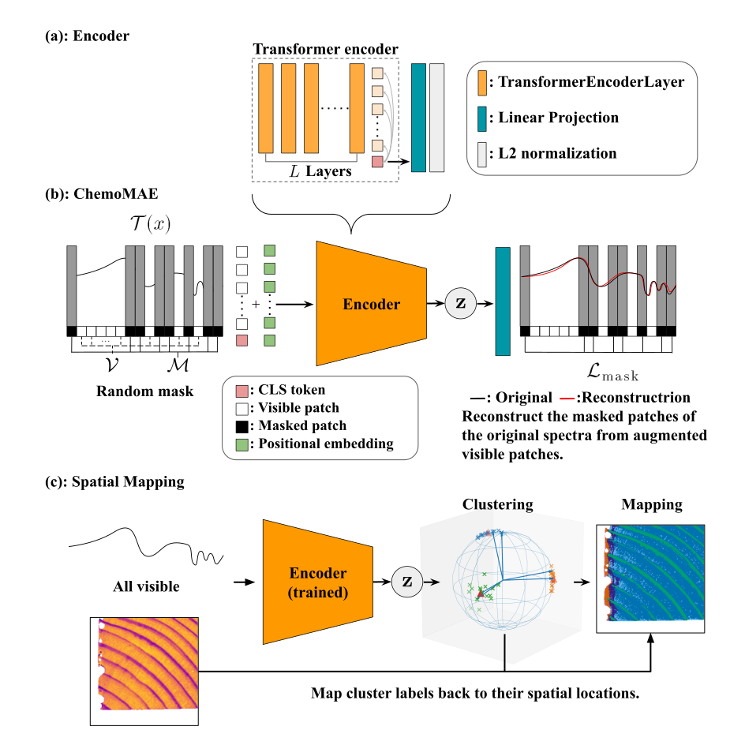

# ChemoMAE — Masked Autoencoder for 1D Spectra

> Module: `chemomae.models.chemo_mae`

This document describes **ChemoMAE**, a Transformer-based masked autoencoder specialized for **one-dimensional spectral data**.

Use `ChemoMAE.get_config()`, `save()`, and `load()` for complete, versioned
configuration-and-weights persistence. See [model artifacts](persistence.md)
for dtype/device behavior, validation, selected EMA snapshots, and the distinction
between inference artifacts and training checkpoints.

<p align="center">

</p>

---

## Overview

**ChemoMAE** adapts the **Masked Autoencoder (MAE)** framework (He et al., 2022) to *1D spectral sequences*.
Each spectrum of length `L` is divided into **`n_patches` contiguous patches**, and a subset of them is randomly masked at training time.

Only **visible patches** are passed to the Transformer encoder, while the decoder reconstructs the **entire sequence** from the latent embedding.
The Trainer computes reconstruction loss on masked regions by default, or on the full spectrum when configured with `loss_region="all"`. The model's forward return value is unchanged.

---

## Key Ideas

### Patch-wise masking

The sequence is reshaped into:

```
(B, L) → (B, n_patches, patch_size)
```

Then `n_mask` patches are randomly hidden per sample.
This creates a reconstruction task at the patch level, encouraging the model to use broader spectral context rather than pointwise cues.

### Encoder

* Patch embeddings → positional encoding
* Only visible patches + a `[CLS]` token are passed to a Transformer encoder
* The `[CLS]` output is projected to `latent_dim`
* If `latent_normalize=True` (default), the latent vector is **L2-normalized**
  for directional metrics, CosineKMeans, and vMF mixtures. Zero projections stay
  zero; projections below `F.normalize`'s epsilon remain below unit norm.

### Decoder

A lightweight **MLP decoder** that maps the latent vector directly to the full-length spectrum `(B, L)`.
The decoder intentionally avoids any patch reconstruction structure to place the learning burden on the encoder.

---

## Architecture

### Positional Encoding

* **Learnable positional embeddings** (current default)
* One CLS position and `n_patches` patch positions are encoded

---

## Masking

Masking is performed by:

```
make_patch_mask(batch_size, seq_len, n_patches, n_mask)
```

* Returns `(B, L)` boolean mask (`True = masked`)
* The model internally converts it to a **visible mask** (`True = visible`)
* `seq_len` must be divisible by `n_patches`

---

## Encoder — `ChemoEncoder`

**Input**

* Spectra `(B, L)`
* Visible mask `(B, L)`

**Pipeline**

1. Patchify the spectrum
2. Linear projection → patch embeddings
3. Gather only visible patches (`V ≤ n_patches`)
4. Add `[CLS]` token
5. Transformer encoder
6. `[CLS]` → linear → (optional) **L2 normalization** controlled by `latent_normalize`

**Output**

* Latent vectors `(B, latent_dim)`
* If `latent_normalize=True`, projections with norm at least the normalization
  epsilon satisfy $\lVert z\rVert_2\approx1$; zero projections stay zero.

---

## Decoder — `ChemoDecoder`

**Input**
`(B, latent_dim)`

**Output**
`(B, L)` full-length reconstruction

The decoder is intentionally simple to emphasize encoder learning.

---

## API

### Class: `ChemoMAE`

```python
mae = ChemoMAE(
    seq_len=256,
    d_model=256,
    nhead=4,
    num_layers=4,
    dim_feedforward=None,   # defaults to 4*d_model
    dropout=0.0,
    decoder_num_layers=2,
    latent_dim=16,
    latent_normalize=True,
    n_patches=16,
    n_mask=4,
)
```

### Parameters

| Name                 | Type   | Default | Description                                        |
| -------------------- | ------ | ------- | -------------------------------------------------- |
| `seq_len`            | int    | 256     | Length of the input spectrum.                      |
| `d_model`            | int    | 256     | Transformer embedding dimension.                   |
| `nhead`              | int    | 4       | Number of attention heads.                         |
| `num_layers`         | int    | 4       | Transformer encoder layers.                        |
| `dim_feedforward`    | int\|None | None  | FFN hidden dimension (`None` → `4*d_model`).       |
| `dropout`            | float  | 0.0     | Dropout in encoder layers.                         |
| `decoder_num_layers` | int    | 2       | MLP decoder layers.                                |
| `latent_dim`         | int    | 16      | Dimension of latent embedding.                     |
| `latent_normalize`   | bool   | True    | If True, L2-normalize latent (`‖z‖=1`).            |
| `n_patches`          | int    | 16      | Number of patches; must divide `seq_len`.          |
| `n_mask`             | int    | 4       | Number of patches to mask.                         |

### Methods

* `forward(x, visible_mask=None, *, n_mask=None, generator=None)` → `(x_recon, z, visible_mask)`
* `reconstruct(x, visible_mask=None, *, n_mask=None, generator=None)` → `x_recon`
* `make_visible(batch_size, *, n_mask=None, device=None, generator=None)` → `visible_mask`
* `encode(x, *, representation="latent")` → all-visible features

### All-visible representations

`encode` uses every patch and bypasses both the decoder and random masking.
No internal hooks are required. The representation is explicit:

| Representation | Shape | Meaning |
| --- | --- | --- |
| `"latent"` | `(B, latent_dim)` | Projected CLS, using `latent_normalize` from model configuration. |
| `"raw_latent"` | `(B, latent_dim)` | CLS projection before normalization. |
| `"normalized_latent"` | `(B, latent_dim)` | Always L2-normalized CLS projection. |
| `"cls"` | `(B, d_model)` | Transformer CLS output before projection. |

```python
mae.eval()
with torch.inference_mode():
    z = mae.encode(x, representation="normalized_latent")
    raw = mae.encode(x, representation="raw_latent")
    cls = mae.encode(x, representation="cls")
```

Each call returns one selected representation. Outputs remain on the input
device and follow model/autocast arithmetic. `encode` preserves module mode and
autograd, allowing a trainable downstream head to consume CLS or latent features.
For inference, the caller controls `eval()` and `inference_mode()`; dropout can
still be stochastic in training mode. An exactly zero projected vector remains
zero under `F.normalize`. Use [Extractor](../training/extractor.md) for bounded,
batch-wise extraction with explicit output device, dtype, and representation.

---

## Usage Examples

### Training

```python
import torch
from chemomae.models import ChemoMAE

mae = ChemoMAE(seq_len=256, latent_dim=16, n_patches=16, n_mask=4, latent_normalize=True)
x = torch.randn(8, 256)

x_recon, z, visible = mae(x)  # visible=True → used in encoder

# Masked reconstruction loss
sqerr = (x_recon - x).pow(2)
loss = sqerr[~visible].mean()
loss.backward()
```

For full-spectrum autoencoder training, use `n_mask=0` and `TrainerConfig(loss_region="all")`. Loss-region selection belongs to the Trainer rather than `ChemoMAE.forward()`.

---

## Downstream Applications

* **Clustering:**
  - If `latent_normalize=True`: CosineKMeans, vMF mixture → latent is hyperspherical
  - If `latent_normalize=False`: normalize on the user side if your downstream assumes cosine geometry

* **Visualization:**
  UMAP / t-SNE using `metric="cosine"` (recommended when using normalized latent)

---

## Design Notes

### Hyperspherical latent (optional)

If `latent_normalize=True`, L2 normalization ensures:

For projections whose norm is at least the `F.normalize` epsilon:

$$
\lVert z \rVert_2 = 1, \qquad \operatorname{cos}(z_i,z_j) = z_i^\top z_j.
$$

This is ideal for cosine geometry and directional clustering.
If disabled, the latent is unconstrained in norm.

### Clean architecture

MAE training utilities (EMA, AMP, checkpointing, loss) are kept outside the model.

### Determinism

Masking is RNG-driven. Provide an explicit `visible_mask`, or a caller-owned
`torch.Generator` on the computation device to control its stream without
replacing global RNG state:

```python
mask_rng = torch.Generator(device=x.device).manual_seed(42)
x_rec, z, visible = mae(x, generator=mask_rng)
mask_rng_state = mask_rng.get_state()  # Save alongside caller-owned run state.
```

An explicit mask ignores `generator` and `n_mask`. All-visible `encode` generates
no masks; train-mode dropout is controlled by Torch's ordinary RNG, separately
from the mask generator. The current encoder exposes the first patch when every
sample in a batch is entirely hidden. For strict masked-input isolation, keep
at least one patch visible in every spectrum; do not use that fallback as a
research protocol.

---

## Minimal Tests

```python
import torch
from chemomae.models import ChemoMAE

mae = ChemoMAE(seq_len=128, latent_dim=8, n_patches=8, n_mask=6, latent_normalize=True)
x = torch.randn(4, 128)

x_rec, z, visible = mae(x)

assert x_rec.shape == x.shape
assert z.shape == (4, 8)
assert visible.shape == (4, 128)

if mae.encoder.latent_normalize:
    assert torch.allclose(z.norm(dim=1), torch.ones(4), atol=1e-5)

# masked loss
sqerr = (x_rec - x).pow(2)
loss = (sqerr[~visible]).mean()
assert torch.isfinite(loss)
```

---

## Version

* v0.2.1 adds Trainer support for explicit masked or full-spectrum loss; the model API is unchanged.
* v0.1.6
