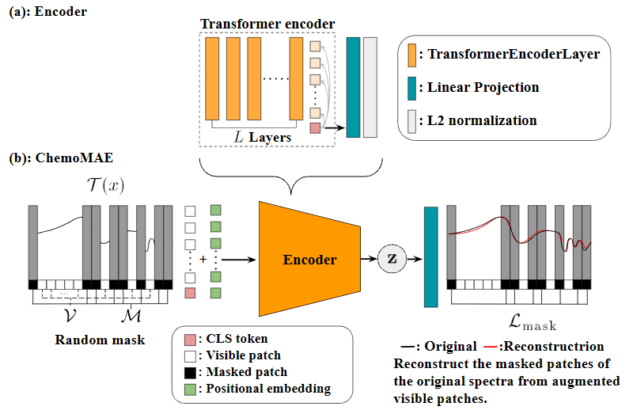

# ChemoMAE: masked reconstruction and spectral features

Module: `chemomae.models.chemo_mae`.

`ChemoMAE` is a PyTorch model for reconstructing one-dimensional spectra and
learning compact representations from them. It encodes visible spectral patches
with a Transformer and decodes one shared latent vector into the full spectrum.
Use it in a custom PyTorch loop or with the package's
[Trainer](../training/trainer.md).

Preprocessing, augmentation, loss selection, and downstream analysis are separate
choices. The model does not require SNV, fit a clusterer, or use spatial
coordinates. Its features can feed a downstream model or an exploratory analysis.

## Quick start

This small CPU example reconstructs partially visible spectra and separately
extracts features with every patch visible.

```python
import torch
from chemomae.models import ChemoMAE

model = ChemoMAE(
    seq_len=16, n_patches=4, n_mask=2,
    d_model=8, nhead=2, num_layers=1, latent_dim=3,
).eval()
spectra = torch.linspace(-1.0, 1.0, steps=48).reshape(3, 16)
mask_generator = torch.Generator(device="cpu").manual_seed(42)

with torch.inference_mode():
    reconstruction, latent, visible = model(spectra, generator=mask_generator)
    features = model.encode(spectra, representation="latent")
    _, all_visible_latent, all_visible = model(spectra, n_mask=0)

assert reconstruction.shape == spectra.shape
assert latent.shape == features.shape == (3, 3)
assert visible.dtype == torch.bool
assert torch.equal(visible.sum(dim=1), torch.full((3,), 8))
assert all_visible.all()
assert torch.isfinite(reconstruction).all() and torch.isfinite(features).all()
torch.testing.assert_close(features, all_visible_latent)
```

The masked `latent` and all-visible `features` need not be equal: they use
different available input patches. `eval()` disables train-mode dropout;
`inference_mode()` disables gradient recording. Both are controlled by the caller.

## Constructor and defaults

All constructor arguments are keyword-only.

| Argument | Type | Default | Contract |
| --- | --- | --- | --- |
| `seq_len` | int | 256 | Input and reconstruction length. |
| `n_patches` | int | 16 | Number of contiguous equal-length patches; must divide `seq_len`. |
| `d_model` | int | 256 | Patch-token and CLS dimension. |
| `nhead` | int | 4 | Attention heads; must divide `d_model`. |
| `num_layers` | int | 4 | Transformer encoder depth. |
| `dim_feedforward` | int or None | None | Feed-forward width; `None` uses `4*d_model`. |
| `dropout` | float | 0.0 | Encoder dropout probability, finite and in `[0, 1]`. |
| `latent_dim` | int | 16 | Dimension of the projected CLS representation. |
| `latent_normalize` | bool | True | Apply L2 normalization to the default projected latent. See the normalization boundary below. |
| `decoder_num_layers` | int | 2 | Number of affine decoder layers; `1` gives one affine map, larger values an MLP with GELU between layers. |
| `n_mask` | int | 4 | Hidden patches per spectrum, in `[0, n_patches]`; see the all-hidden exception below. |

Dimensions and layer counts must be positive integers. `ChemoMAEConfig` validates
the complete constructor configuration. [Model artifacts](persistence.md) save
this configuration with selected weights so it does not have to be inferred from
a state dict.

## Input, output, and execution contract

Supply nonempty floating Torch spectra with shape `(B, seq_len)` on the model's
computation device and with a compatible dtype. Move/cast inputs and the model
explicitly as needed; these methods are not data loaders. Reconstruction and
feature tensors remain on the computation device and follow model/autocast
arithmetic. For stable results, use finite input values.

| Method | Result |
| --- | --- |
| `forward(x, visible_mask=None, *, n_mask=None, generator=None)` | Tuple `(x_recon, z, visible_mask)` with shapes `(B, seq_len)`, `(B, latent_dim)`, `(B, seq_len)`. |
| `reconstruct(x, visible_mask=None, *, n_mask=None, generator=None)` | Full reconstruction `(B, seq_len)` only. |
| `make_visible(batch_size, *, n_mask=None, device=None, generator=None)` | Boolean visible mask `(B, seq_len)`; standalone calls default to CPU. |
| `encode(x, *, representation="latent")` | One all-visible representation, described below. |

`forward`, `reconstruct`, and `encode` preserve module mode and autograd. They do
not calculate a loss. [Trainer](../training/trainer.md) or the caller selects the
reconstruction target and loss region. Supplying an explicit `visible_mask`
ignores `n_mask` and `generator`.

### All-visible representations

`encode` bypasses random masking and the decoder. It returns one selected
representation per call:

| Representation | Shape | Meaning |
| --- | --- | --- |
| `"latent"` | `(B, latent_dim)` | Projected CLS, normalized according to `latent_normalize`. |
| `"raw_latent"` | `(B, latent_dim)` | CLS projection before normalization. |
| `"normalized_latent"` | `(B, latent_dim)` | L2-normalized CLS projection regardless of model configuration. |
| `"cls"` | `(B, d_model)` | Transformer CLS output before projection. |

Choose the representation to match the downstream method. Because autograd is
preserved, `encode` can also supply features to a trainable head. For bounded
batch-wise inference with explicit output device, dtype, and representation, use
[Extractor](../training/extractor.md).

## Mask contract

ChemoMAE masks contiguous patches, not arbitrary individual channels. Each patch
has `patch_size = seq_len // n_patches` channels. An explicit `visible_mask` must
be boolean, have the same shape as `x`, and mark every channel within each patch
with the same value. Partially visible patches raise `ValueError`. Samples in a
batch may have different visible patch counts.

| Mask | `True` means |
| --- | --- |
| `visible_mask`, including `make_visible` output | Patch requested as visible to the encoder. |
| `make_patch_mask` output | Patch selected to be hidden. |
| [Loss selection mask](losses.md) | Position included in the loss. |

Without an explicit mask, each forward call independently selects `n_mask`
patches per spectrum. Omitted `n_mask` uses the model's configured value. These
masks are generated on `x.device`. With `n_mask=0`, all patches are visible and
masking draws no random numbers.

The low-level helper is
`make_patch_mask(batch_size, seq_len, n_patches, n_mask, *, device=None, generator=None)`.
It returns a boolean `(B, seq_len)` hidden mask, with `device=None` meaning CPU.
Use its logical inverse as a visible mask. `seq_len` must be divisible by
`n_patches`, and the hidden patch count must be in `[0, n_patches]`.

### Returned mask and the all-hidden exception

`forward` returns the **supplied or generated mask**, not a record of every
internal encoder adjustment. The encoder converts an explicit mask to the input
device internally, while the returned tensor retains its original device.
Supply the mask on `x.device` when it will also be used to select loss elements.

There is a legacy exception when **every sample in a batch has every patch
hidden**: the encoder exposes the first patch of each spectrum to continue the
forward computation. The returned mask is still all `False`; it does not record
that fallback. Inverting it therefore includes the exposed first patch in the
selected loss. The fallback is batch-wide, so an all-hidden sample in a mixed
batch does not trigger the same behavior.

For strict masked-input isolation, keep at least one patch visible in every
spectrum. This exception is not an implementation of reconstruction from no
observed channels. With `n_mask=0`, select all channels explicitly for training;
an empty masked loss is handled according to the [loss contract](losses.md).

### Randomness

A caller-owned `torch.Generator` on the mask computation device controls generated
masks without replacing global RNG state. Repeated calls advance that generator;
save its state alongside caller-owned run state when replay is needed. Without a
generator, masking uses the ordinary device RNG stream.

An explicit mask and all-visible `encode` draw no masking randomness. Train-mode
dropout uses Torch's ordinary RNG, independently of any mask generator. A fixed
mask alone does not make train-mode execution deterministic.

## Architecture

<p align="center">

</p>

### Encoder

`ChemoEncoder` reshapes `(B, L)` spectra into
`(B, n_patches, patch_size)` and linearly embeds each patch. It gathers visible
patches, pads to the maximum visible count in the batch, and prepends a learned
CLS token. Each token receives its original patch-position embedding, so hidden
patches do not shift the wavelength-position identity of visible ones. Padding
is excluded from attention. Positional embeddings are learned, with one CLS
position and one position per patch.

A pre-norm Transformer with GELU feed-forward layers processes those tokens. The
CLS output is linearly projected to `latent_dim`, with optional L2 normalization.
`ChemoEncoder.forward(x, visible_mask, representation=...)` exposes the same four
representation choices as `encode`, but uses the supplied visibility pattern.

### Decoder

`ChemoDecoder` maps the shared latent `(B, latent_dim)` directly to `(B, L)`.
It uses no input skip connections, per-patch encoder outputs, or decoder mask
tokens. Every channel is reconstructed regardless of which channels enter a loss.

`decoder_num_layers=1` gives a single affine map. Larger values give an MLP whose
hidden width is `seq_len`, with GELU between affine layers. The standalone
`ChemoDecoder` also accepts an explicit `hidden_dim`. It performs no output
normalization.

### Normalization and geometry

For a raw projection $u$, normalized representations use Torch's `F.normalize`
with its default epsilon:

$$
z = \frac{u}{\max(\lVert u\rVert_2,\varepsilon)},
\qquad \varepsilon = 10^{-12}.
$$

When the norm is at least epsilon and the arithmetic is representable,
$\lVert z\rVert_2\approx1$ and cosine similarity can be evaluated as a dot product:

$$
\cos(z_i,z_j) = z_i^\top z_j.
$$

Below that threshold the norm is smaller than one; an exactly zero projection
remains zero when epsilon is representable in the computation dtype. Very low
precision can change this boundary, so do not assume all outputs are valid unit
vectors merely because normalization is enabled. With `latent_normalize=False`,
the default latent has unconstrained norm.

The latent has no zero-mean constraint. Even when inputs were standardized with
[SNV](../preprocessing/snv.md), normalization does not make the encoder preserve
numerical cosine similarities from input space.

## Training and downstream use

The reconstruction task asks the model to predict omitted bands from visible
context. With [spectral augmentation](../training/augmenter.md), a training loop
can perturb the complete input before masking while retaining the input from
before the added perturbation as its target. That observed target need not be a
noise-free spectrum. The model itself supports either target choice.

For full-spectrum autoencoder training, use `n_mask=0` and
`TrainerConfig(loss_region="all")`. For masked reconstruction, the Trainer default
selects hidden channels. Optimizers, AMP, EMA, checkpoints, and loss aggregation
remain outside the model.

For downstream comparison with fixed learned weights, all-visible extraction
without added perturbation provides one feature vector per supplied spectrum.
Directional clusterers such as CosineKMeans and vMF mixtures are optional
consumers of those features. Choose preprocessing, representation, cluster count,
and evaluation according to the application; usefulness is not guaranteed by a
low reconstruction error alone. If spectra belong to an image, retain their
coordinates outside the model when constructing a spatial map.

## Related references

- [Selected reconstruction losses](losses.md)
- [Model artifacts and training checkpoints](persistence.md)
- [Trainer](../training/trainer.md) and [Extractor](../training/extractor.md)
- Implementation checks: `tests/models/test_chemo_mae_forward.py`,
  `test_chemo_mae_mask.py`, and `test_chemo_mae_encode.py` in the same directory.
