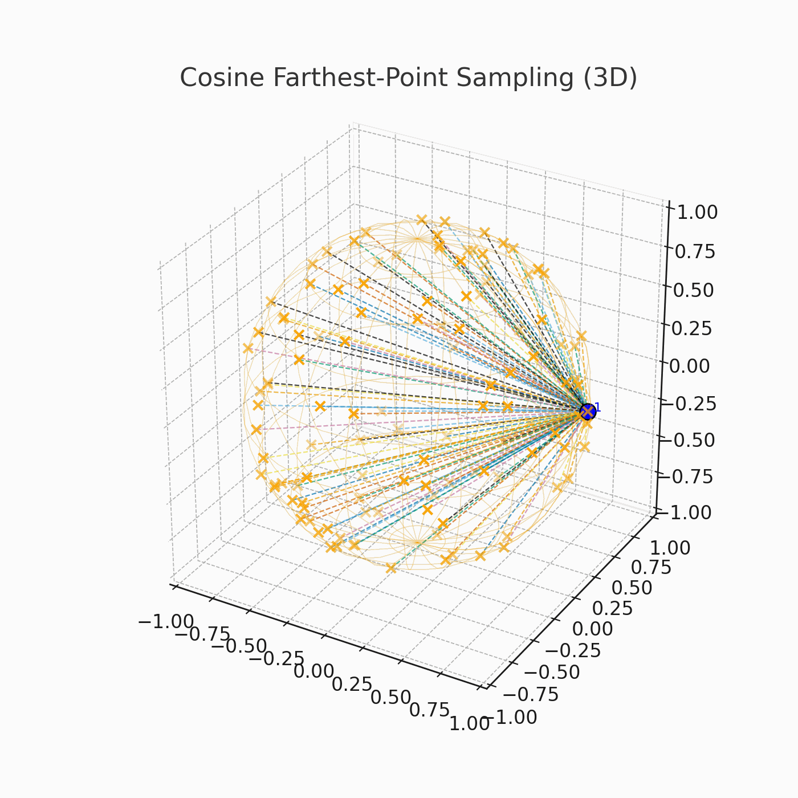

# FPS Downsampling — Farthest-Point Sampling on the unit sphere

> Module: `chemomae.preprocessing.downsampling`

This document describes **`cosine_fps_downsample`**, a diversity-first subsampling method that selects spectra that are maximally spread in direction under cosine geometry. The implementation auto-uses **CUDA** when available and returns data in the **original scale** (normalization is internal to selection only). 

<p align="center">

</p>

---

## Overview

We start from a collection of spectra

```math
X = \{\mathbf{x}_1, \dots, \mathbf{x}_N\} \subset \mathbb{R}^C
```

Each spectrum is projected onto the unit sphere by L2 normalization:

```math
\tilde{\mathbf{x}}_i = \frac{\mathbf{x}_i}{\lVert \mathbf{x}_i \rVert_2 + \varepsilon},
\quad \lVert \tilde{\mathbf{x}}_i \rVert_2 \approx 1
```

As the dissimilarity measure we use the **cosine distance**:

```math
d(\tilde{\mathbf{x}}_i,\tilde{\mathbf{x}}_j)
= 1 - \tilde{\mathbf{x}}_i^\top \tilde{\mathbf{x}}_j
\in [0,2]
```

This quantity grows as the angle between vectors increases:

* $`d \approx 0`$ means the two spectra are very similar (same direction).
* $`d \approx 2`$ means they point in opposite directions (maximally dissimilar).


### Farthest Point Sampling (FPS)

The goal of FPS is to select a diverse subset of size

```math
k = \max \bigl( 1, \mathrm{round}(\rho N) \bigr)
```

Let the chosen indices be

```math
\mathcal{S}_k = \{s_1, \dots, s_k\}
```

The algorithm proceeds greedily:

```math
s_1 \ \text{is chosen at random (or fixed)}, \qquad
s_t = \arg\max_{i \notin \mathcal{S}_{t-1}} \ 
        \min_{j \in \mathcal{S}_{t-1}} 
        d(\tilde{\mathbf{x}}_i, \tilde{\mathbf{x}}_j)
```

In words:

* For each candidate $i$ outside the set, compute its distance to every point already in the set.
* Record the **closest distance** (how near $i$ is to the current subset).
* Select the candidate whose closest distance is the **largest** overall.

Thus FPS repeatedly adds the point that is *as far as possible from its nearest neighbor in the subset*, ensuring the selected points are spread out with a large margin.

### Vectorized Implementation

For efficiency, FPS maintains a vector of the current nearest distances

```math
\mathbf{d}_{\min} \in \mathbb{R}^N,
```

where $`\mathbf{d}_{\min}[i]`$ is the distance from candidate $`i`$ to its nearest selected neighbor.
When a new point $`\tilde{\mathbf{x}}_s`$ is chosen, the update is:

```math
\mathbf{d}_{\min} \leftarrow
\min \Bigl( \mathbf{d}_{\min}, \ \mathbf{1} - X_{\text{unit}} \tilde{\mathbf{x}}_{s} \Bigr),
```

where $`X_{\text{unit}}`$ is the row-normalized data matrix.
This update rule means:

* Compute cosine distances between all points and the newly selected one ($`1 - X_{\text{unit}} \tilde{\mathbf{x}}_{s}`$).
* Update each entry of $`\mathbf{d}_{\min}`$ by taking the smaller value with the new distances.

Each iteration therefore requires only **one matrix–vector multiplication** followed by an elementwise `min`, which can be implemented very efficiently with `torch.matmul` and in-place updates.

---

## API

### Function: `cosine_fps_downsample(...)`

```python
cosine_fps_downsample(
    X: np.ndarray | torch.Tensor, *,
    ratio: float = 0.1,
    ensure_unit_sphere: bool = True,
    seed: Optional[int] = None,
    init_index: Optional[int] = None,
    return_numpy: bool = True,
    eps: float = 1e-12,
) -> (np.ndarray | torch.Tensor)  # shape: (k, C), k = max(1, round(N*ratio))
```

**Parameters**

* `X`: `(N, C)` spectra. NumPy or Torch.
* `ratio`: target fraction $\rho$; selects $k=\max(1,\mathrm{round}(\rho N))$.
* `ensure_unit_sphere`: if `True`, L2-normalizes rows internally before FPS.
* `seed`: RNG seed for the initial point (used if `init_index` is `None`).
* `init_index`: fix the initial index deterministically.
* `return_numpy`: `True` → return NumPy; `False` → return Torch tensor.

**Behavior & Types**

* **Device:** runs on CUDA automatically when available; falls back to CPU. 
* **Return type:** NumPy in → NumPy out by default; Torch in → stays Torch if `return_numpy=False` (device preserved). 
* **Complexity:** $O(Nk)$ inner products; memory $O(N)$. Implementation reuses temporaries to reduce GPU churn. 

---

## Usage Examples

### NumPy — basic

```python
import numpy as np
from chemomae.preprocessing import cosine_fps_downsample

# X: (N, C) NumPy array (e.g., after SNV)
X_sub = cosine_fps_downsample(X, ratio=0.10, ensure_unit_sphere=True, seed=42)
# -> NumPy array, shape (ceil(0.1*N), C)
```

### Torch — return tensor, same device

```python
import torch
from chemomae.preprocessing import cosine_fps_downsample

Xt = torch.randn(5000, 128, device="cuda", dtype=torch.float32)
Xt_sub = cosine_fps_downsample(Xt, ratio=0.1, return_numpy=False)  # -> torch.Tensor on CUDA
```

### With SNV (recommended before cosine geometry)

```python
from chemomae.preprocessing import SNVScaler, cosine_fps_downsample

X_snv = SNVScaler().transform(X)                  # per-spectrum standardization
X_sub = cosine_fps_downsample(X_snv, ratio=0.1)   # diversity-first subset
```

(Use L2 normalization internally via `ensure_unit_sphere=True`.) 

---

## Design Notes & Edge Cases

* **Internal normalization:** When `ensure_unit_sphere=True`, the function computes row L2 norms and normalizes once; the returned subset comes from the **original** `X`. 
* **CUDA auto-selection:** uses `torch.cuda.is_available()` to decide device; tensors are moved once and kept there. 
* **In-place / buffer reuse:** distance updates avoid new allocations (`addmv_`, `minimum(..., out=...)`), reducing “reserved memory creep”. 
* **Empty input:** if `N=0`, returns an empty array/tensor with shape `(0, C)`.
* **Seed & determinism:** set `seed` or provide `init_index` for reproducible starts. Subsequent choices are deterministic given the start. 

---

## When to Use `cosine_fps_downsample` in ChemoMAE Pipelines

* **Diversity over density:** prefer FPS when you want broad directional coverage and to avoid redundant micro-clusters (common with large-K k-means).
* **HSI/NIR preprocessing:** after SNV, FPS provides a compact, diverse subset prior to self-supervised training. (If you need density-proportional sampling instead, use cosine k-means + stratified allocation.) 

---

## Common Pitfalls

* **Expecting density weighting:** FPS is diversity-first; it won’t oversample dense regions by design.
* **Forgetting internal normalization:** if you disable `ensure_unit_sphere`, cosine geometry assumptions may break unless your input already lies on the unit sphere. 
* **Reading GPU memory graphs:** PyTorch **reserves** CUDA memory; “reserved” can grow and plateau even when “allocated” goes up/down—this is normal, not a leak.

---

## Minimal Test Snippets

```python
import numpy as np
from chemomae.preprocessing import cosine_fps_downsample

# Shapes and types
X = np.random.randn(123, 7).astype(np.float32)
Y = cosine_fps_downsample(X, ratio=0.1)                    # -> (max(1, round(12)), 7)
assert Y.shape[1] == X.shape[1]

# Reproducibility with seed
A = cosine_fps_downsample(X, ratio=0.2, seed=111)
B = cosine_fps_downsample(X, ratio=0.2, seed=111)
np.testing.assert_allclose(A, B)

# Invariance to row scaling when ensure_unit_sphere=True
scales = np.exp(np.random.randn(X.shape[0], 1).astype(np.float32))
X2 = X * scales
U  = cosine_fps_downsample(X,  ratio=0.1, ensure_unit_sphere=True)
U2 = cosine_fps_downsample(X2, ratio=0.1, ensure_unit_sphere=True)
def unit(Z): return Z / (np.linalg.norm(Z, axis=1, keepdims=True) + 1e-12)
np.testing.assert_allclose(unit(U), unit(U2), atol=1e-5)
```

---

## Version

* Introduced in `chemomae.preprocessing.downsampling` — initial public draft. 
