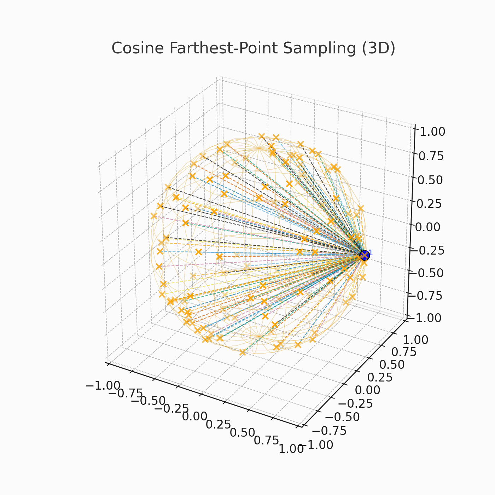

# Cosine farthest-point sampling

> API reference for ChemoMAE v0.2.4.

Module: `chemomae.preprocessing.downsampling`.

`cosine_fps_downsample` selects a subset of rows with a greedy farthest-point
procedure. Selection uses internally normalized rows; returned rows retain their
original values and scale. Use it when coverage of distinct spectral directions
is more useful than preserving the frequency of each spectral pattern.

FPS is an optional sampling operation. It does not perform SNV, learn a
representation, define a dataset split, or preserve spatial coverage.

## Quick start

This CPU example selects three of six spectra and retains the indices needed to
look up associated metadata.

```python
import numpy as np
from chemomae.preprocessing import cosine_fps_downsample

spectra = np.array(
    [[1.0, 0.0, 0.0], [0.0, 1.0, 0.0], [0.0, 0.0, 1.0],
     [-1.0, 0.0, 0.0], [0.0, -1.0, 0.0], [0.0, 0.0, -1.0]],
    dtype=np.float32,
)
subset, indices = cosine_fps_downsample(
    spectra, ratio=0.5, init_index=0, device="cpu", return_indices=True,
)

assert subset.shape == (3, 3)
assert indices.shape == (3,) and indices.dtype == np.int64
assert indices[0] == 0 and np.unique(indices).size == 3
assert subset.dtype == spectra.dtype
np.testing.assert_array_equal(subset, spectra[indices])
```

## API contract

```text
cosine_fps_downsample(
    X, *, ratio=0.1, seed=None, init_index=None,
    return_numpy=True, return_indices=False, eps=1e-12,
    device=None, generator=None,
)
```

| Argument | Contract |
| --- | --- |
| `X` | NumPy array or dense Torch tensor, shape `(N, L)`, with finite real numerical values supported by Torch. |
| `ratio` | Positive finite fraction; the selected count is clipped to `[1, N]` for nonempty input. Ratios at least one select all rows. |
| `seed` | Optional integer seed for a local initial-point RNG. Mutually exclusive with `generator`. |
| `init_index` | Optional integer in `[0, N)`, fixing the first selected row. No random numbers are drawn when supplied. |
| `return_numpy` | `True` by default; `False` returns Torch tensors, including for NumPy input. |
| `return_indices` | `False` by default; `True` returns `(selected_rows, indices)`. |
| `eps` | Positive finite value added to each row norm for selection, default `1e-12`. |
| `device` | CPU/CUDA computation device as a string or `torch.device`. `None` follows Torch input, or uses CPU for NumPy input. |
| `generator` | Optional caller-owned `torch.Generator` on the computation device, used to choose the initial row. |

For nonempty input, the count is

$$
k = \min\bigl(N,\max(1,\mathrm{round}(\rho N))\bigr),
\qquad \rho = \text{ratio}.
$$

Rounding follows Python's `round`, including ties to even. Returned rows have
shape `(k, L)`. Optional indices have shape `(k,)`, use `int64`/`torch.long`, and
are in **selection order**, not sorted input order. Indices cannot repeat, but
distinct source rows may contain identical values. Even when all rows are
selected, their order follows FPS.

### Return framework, dtype, and device

| Input | `return_numpy` | Rows and indices |
| --- | --- | --- |
| NumPy | `True` | NumPy arrays; rows keep the input dtype. |
| NumPy | `False` | Torch tensors on the computation device; rows keep the input dtype. |
| Torch | `True` | NumPy arrays on CPU; rows keep the source dtype except bfloat16 is promoted to float32. |
| Torch | `False` | Torch tensors on the **original input device**, even if computation used another device; rows keep the input dtype. |

An explicit computation device controls selection, not necessarily the returned
Torch device. CUDA is never selected merely because it is available, and an
unavailable CUDA request raises an error. FPS supports CPU and CUDA computation.

Selection uses float64 arithmetic for float64 input and float32 otherwise.
Surrounding CPU/CUDA autocast is disabled inside the selection computation. This
internal arithmetic does not change the returned row dtype or original values.
FPS is discrete and does not record autograd.

### Validation and boundary cases

- Empty row input `(0, L)` returns `(0, L)` rows and, when requested, empty indices
  in the requested output framework. A zero feature dimension is invalid.
- Boolean, complex, nonfinite, and unsupported inputs are rejected. Sparse and
  meta tensors are not supported.
- `ratio` and `eps` must be positive and finite; `init_index` must be an integer
  within the input row range. The `seed` and `generator` arguments remain mutually
  exclusive even when an explicit initial index avoids a random draw.
- Nonfinite converted data, overflowing norms, or a normalization denominator
  that becomes zero/nonfinite in the computation dtype raise an error.
- Zero rows remain zero and have dissimilarity one to every row, including
  another zero row. Ties choose the first remaining row.

### Randomness and reproducibility

`seed` creates a local generator for the initial-point draw. With neither seed
nor generator, that draw uses the computation device's global stream without
reseeding it. An explicit `init_index` avoids drawing random numbers. A supplied
generator advances when a draw occurs; persist its state outside FPS if needed.

A fixed initial point makes the greedy choices reproducible under the same
arithmetic conditions. Device/dtype differences and numerical ties can change
selection; an identical seed alone is not a cross-device equivalence guarantee.

## Selection geometry

For selection, the implementation transforms each row as

$$
\tilde{x}_i = \frac{x_i}{\lVert x_i\rVert_2 + \varepsilon},
\qquad
\lVert\tilde{x}_i\rVert_2
= \frac{\lVert x_i\rVert_2}{\lVert x_i\rVert_2 + \varepsilon}.
$$

This is approximately a unit vector only when the original norm is much larger
than epsilon. The selection dissimilarity is based on

$$
d(\tilde{x}_i,\tilde{x}_j)
= 1 - \tilde{x}_i^\top\tilde{x}_j.
$$

For rows well above the epsilon scale, this approximates cosine distance:
values near zero indicate similar directions, and values near two indicate
opposite directions. For norms comparable to epsilon, the shrunken row norms
also affect the score. In that regime, selection is not invariant to positive
row scaling. The formula makes the distinction explicit; FPS does not change
or remove near-zero rows automatically.

If the application compares mean-centered spectral shape,
[SNV](snv.md) can be applied before FPS. If absolute offset information is useful,
that preprocessing choice may be inappropriate. FPS always performs its own
selection normalization; no additional L2 normalization is required.

## Greedy algorithm

Let $\mathcal{S}_t$ contain the first $t$ selected indices. After a random or
explicitly fixed initial index, each step chooses

$$
s_{t+1} = \mathop{\mathrm{arg}\ \mathrm{max}}\limits_{i\notin\mathcal{S}_t}
          \min_{j\in\mathcal{S}_t}d(\tilde{x}_i,\tilde{x}_j).
$$

Thus, the next row is the candidate whose distance to its **nearest selected
row** is largest. This encourages coverage but does not guarantee globally
optimal or uniform coverage.

<p align="center">

</p>

The implementation maintains current nearest distances
$\mathbf{d}_{\min}\in\mathbb{R}^N$. After selecting row $s$, it updates

$$
\mathbf{d}_{\min} \leftarrow
\min\bigl(\mathbf{d}_{\min},\mathbf{1}-\tilde{X}\tilde{x}_s\bigr),
$$

where $\tilde{X}$ contains the normalized rows and the minimum is elementwise.
Already selected indices are excluded from future choices. Dot-product scores
are bounded in the implementation to limit roundoff effects on distances.

Each step performs a matrix-vector product over the supplied rows. Selection
costs $O(Nk)$ inner products of length $L$, or $O(NkL)$ arithmetic. Working rows
occupy $O(NL)$ memory, distances $O(N)$, and selected indices $O(k)$. The full
working matrix remains resident; this helper is not a streaming sampler.
Selecting the next index also synchronizes a scalar on CUDA.

## Using the selected subset

Retain `indices` alongside sample identifiers and other metadata. FPS changes
the frequency of spectral patterns in the subset; it should not be treated as
a density-preserving random sample. It may also select unusual rows, so its
coverage objective does not substitute for input quality checks.

When using FPS to reduce training data, define the train/validation/test split
before sampling according to the application's independence requirements.
Whether to sample within a group or across pooled training data determines how
groups contribute to the selected set. FPS itself makes neither that decision
nor any balancing guarantee. For spatial data, spectral-direction coverage does
not imply coverage of image locations.

## Related references

- [Standard Normal Variate](snv.md)
- [Workflow tutorial](../tutorials/workflow.md) for one optional use of FPS.
- Implementation checks: `tests/preprocessing/test_fps.py`
